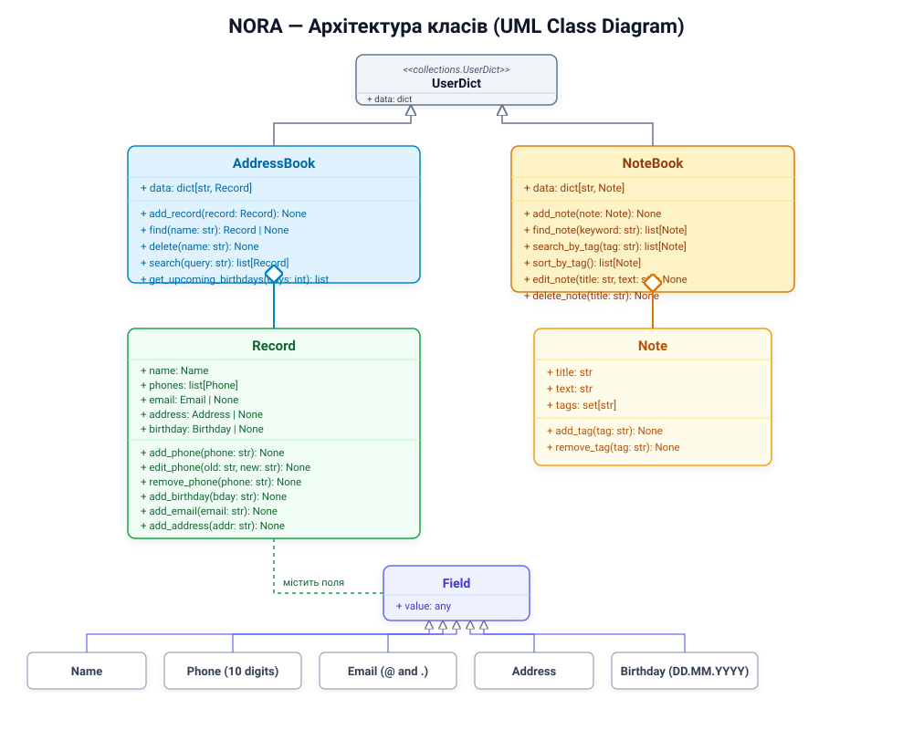

# NORA — персональний помічник IT-рекрутера

👱‍♀️ NORA 🤝 - персональний консольний помічник рекрутера для зручної організації контактів кандидатів та нотаток після комунікації і співбесід. Проєкт розроблено як фінальну командну роботу.

## Цільова аудиторія та проблема

- **Типовий користувач:** Анастасія, 30 років, IT-рекрутер, яка одночасно працює з великою кількістю кандидатів на різні вакансії.
- **Проблема користувача:** Контакти кандидатів, інформація про їхній досвід і нотатки після співбесід зберігаються в різних месенджерах, документах і файлах. Через це складно швидко знайти потрібного кандидата та відновити історію комунікації.

## Як NORA допомагає

NORA дозволяє:
- Зберігати контакти кандидатів (ім'я, номери телефонів, email, адресу, день народження).
- Проводити валідацію введених даних (номер телефону — рівно 10 цифр, email — наявність '@' та домену, день народження — формат `DD.MM.YYYY`).
- Нагадувати про найближчі дні народження кандидатів наперед (за вказану кількість днів).
- Знаходити, редагувати та видаляти контакти.
- Створювати нотатки після співбесід зі збереженням інформації про досвід, навички та побажання кандидатів.
- Використовувати теги (`python`, `frontend`, `designer`, `junior`, `senior`, `interview`).
- Знаходити та сортувати нотатки за спеціалізацією або рівнем кандидата.
- Автоматично зберігати дані на диску через pickle після перезапуску програми.
- Вгадувати команду, якщо користувач зробив невелику помилку в написанні.

## Структура проєкту

```text
.
├── Main.py               # Точка входу в програму (головний цикл бота NORA)
├── classes.py            # Класи даних (AddressBook, Record, NoteBook, Note, поля)
├── commands.py           # Функції-обробники команд бота та декоратор @input_error
├── storage.py            # Логіка збереження та завантаження даних через pickle
├── class_diagram.drawio  # UML-діаграма класів (для відкриття на diagrams.net)
├── LICENSE               # Ліцензія проєкту (MIT)
├── requirements.txt      # Зовнішні залежності (colorama)
└── README.md             # Документація проєкту та інструкція
```

## Архітектура класів (UML-діаграма)



<details>
<summary><b>Натисніть тут, щоб переглянути текстову Mermaid-схему</b></summary>

<pre><code>classDiagram
    class UserDict {
        +dict data
    }

    class Field {
        +any value
        +__str__() str
    }

    class Name {
    }

    class Phone {
        +__init__(str value)
    }

    class Email {
        +__init__(str value)
    }

    class Address {
    }

    class Birthday {
        +__init__(str value)
    }

    class Record {
        +Name name
        +list phones
        +Email email
        +Address address
        +Birthday birthday
        +add_phone(str phone)
        +edit_phone(str old_phone, str new_phone)
        +remove_phone(str phone)
        +add_birthday(str birthday)
        +add_email(str email)
        +add_address(str address)
        +__str__() str
    }

    class AddressBook {
        +dict data
        +add_record(Record record)
        +find(str name) Record
        +delete(str name)
        +search(str query) list
        +get_upcoming_birthdays(int days) list
    }

    class Note {
        +str title
        +str text
        +set tags
        +add_tag(str tag)
        +remove_tag(str tag)
        +__str__() str
    }

    class NoteBook {
        +dict data
        +add_note(Note note)
        +find_note(str keyword) list
        +search_by_tag(str tag) list
        +sort_by_tag() list
        +edit_note(str title, str new_text)
        +delete_note(str title)
    }

    UserDict &lt;|-- AddressBook
    UserDict &lt;|-- NoteBook

    Field &lt;|-- Name
    Field &lt;|-- Phone
    Field &lt;|-- Email
    Field &lt;|-- Address
    Field &lt;|-- Birthday

    AddressBook o-- Record
    Record *-- Name
    Record o-- Phone
    Record o-- Email
    Record o-- Address
    Record o-- Birthday

    NoteBook o-- Note</code></pre>
</details>

## Список доступних команд

### Керування контактами кандидатів:
- `hello` — привітання від бота.
- `help` — показати довідку з усіма доступними командами.
- `add [ім'я] [телефон]` — додати новий контакт або додатковий номер телефону.
- `change [ім'я] [старий_номер] [новий_номер]` — змінити номер телефону контакту.
- `phone [ім'я]` — показати всі номери телефону контакту.
- `all` — показати всіх кандидатів з усіма збереженими полями.
- `search [запит]` — пошук контактів за ім'ям, телефоном, email або адресою.
- `add-birthday [ім'я] [DD.MM.YYYY]` — додати дату народження контакту.
- `show-birthday [ім'я]` — показати дату народження контакту.
- `birthdays [дні]` — показати найближчі дні народження (за замовчуванням: 7 днів).
- `add-email [ім'я] [email]` — додати email контакту.
- `add-address [ім'я] [адреса]` — додати адресу проживання контакту.
- `delete-contact [ім'я]` — видалити контакт з книги.

### Робота з нотатками після співбесід:
- `add-note [назва] [текст]` — створити нову нотатку про кандидата.
- `edit-note [назва] [новий_текст]` — змінити текст існуючої нотатки.
- `delete-note [назва]` — видалити нотатку за назвою.
- `add-tag [назва] [тег]` — додати тег до нотатки (наприклад: python, senior).
- `find-note [текст]` — знайти нотатки за ключовим словом або фрагментом тексту.
- `find-tag [тег]` (або `search-by-tag`) — знайти всі нотатки за вказаним тегом.
- `sort-notes` — вивести всі нотатки, відсортовані за тегами в алфавітному порядку.
- `all-notes` (або `show-notes`) — показати всі збережені нотатки.

### Завершення роботи:
- `close`, `exit` — завершити роботу та зберегти всі дані у файл на диску.

## Як запустити проєкт

1. Клонуємо репозиторій:
```bash
git clone https://github.com/onagorniy-ui/project-CodeCrew7.git
cd project-CodeCrew7
```

2. Створюємо та активуємо віртуальне середовище:
```bash
python3 -m venv .venv
source .venv/bin/activate  # для macOS / Linux
# .venv\Scripts\activate   # для Windows
```

3. Встановлюємо залежності:
```bash
pip install -r requirements.txt
```

4. Запускаємо помічника NORA:
```bash
python Main.py
```

## Як ми працюємо в команді з Git
- У гілку `main` напряму нічого не комітимо і не пушимо.
- Перед початком роботи обов'язково оновлюємо свій main: `git pull origin main`.
- Під кожну нову задачу створюємо окрему гілку:
  `git checkout -b feature/назва-задачі`
- Після написання та перевірки коду робимо коміт і пушимо у свою гілку:
  `git add .`
  `git commit -m "опис того що зробили"`
  `git push -u origin feature/назва-задачі`
- На GitHub створюємо Pull Request, проводимо рев'ю (Code Review) і зливаємо зміни в `main`.
